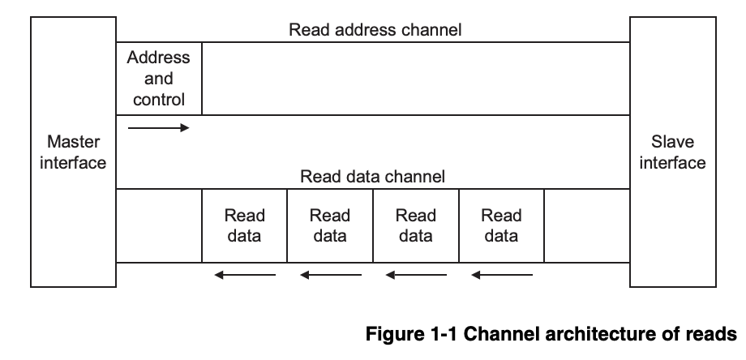
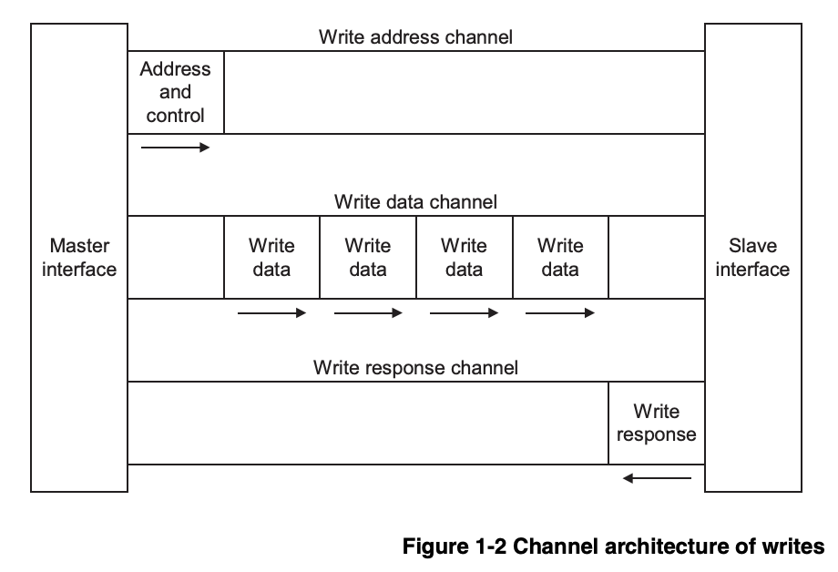

# Full Guide to SystemVerilog UVM (Universal Verification Methodology)

## Preface to Reader

To properly view all README files on VSCode, open this folder in VSCode and `Ctrl + Shift + V` for Windows or `Cmd + Shift + V` 
for Mac devices for better visuals and cleaner markdown formatting. It'll look prettier, I promise 😆. 

See how I apply these UVM techniques to the AXI protocol that I'll design and build using SystemVerilog. Look at the `rtl-design` folder to learn more in detail about how I designed the system and look at the `verification` folder for more detail on UVM and how it works at the low level. This README just provides a general summary of what this project is about. Thanks for stopping by!

---

## Overall Architecture + Summary

<p align="center">
    
</p>

This diagram is a really good model for understanding how the UVM ecosystem works, especially once you get into the build phases of each module. It makes a lot of intuitive sense on what modules belong where in which module's build phase, and it makes visualizing it as a cohesive system a lot easier. Essentially, the general UVM model (which is your top module) consists of two models, your design under test (the design you want to stress-test and simulate) and your actual test.

Within your actual test model, you need to set up the environment, which consists of an agent (who kinda does all of the testing manually) and the scoreboard, which keeps track of how well your simulation's doing. The agent uses a sequencer, which arbitrates the flow of stimulus transactions while the driver takes these transactions and drives the actual pin-level signals onto the DUT. The monitor then takes the actual pin activity from the DUT, converts it back to transaction-level objects, then updates it to your scoreboard.

---

## Object-Oriented Programming

All of the modules, save for the top module, extend from an existing SystemVerilog class framework. This makes the code modular and reusable. When a module (or in this case, class) extends from a parent class, it inherits all the attributes and functions of that parent class.

For example, let's look at `agent.sv`:

```Verilog
class agent extends uvm_agent;

    `uvm_component_utils(agent);

    function new(string name = "agent", uvm_component parent = null);
        super.new(name, parent);
    endfunction

endclass
```

Notice two things: the `extends` keyword and the `super` function called in the new constructor of this class. This is highly reminiscent of languages that exhibit object-oriented programming like Java:

```Java
public class Vehicle {
    private int year;
    private double mileage;

    // parent constructor
    public Vehicle(int year, double mileage) {
        self.year = year;
        self.mileage = mileage;
    }

    // whatever functions you have defined here
}

// Java's OOP allows for inheritance through polymorphism
public class Toyota extends Vehicle {
    // these fields are inferred to exist because
    // the parent class

    // private int year;
    // private double mileage;

    // here we add an additional field
    private String model;

    // since we're calling the constructor of the child class,
    // we need to invoke the super function
    public Toyota(int year, double mileage, String model) {
        // explicitly invokes superclass constructor
        super(year, mileage);
        self.model = model;
    }
    // whatever functions from Vehicle superclass is assumed
    // to exist in the Toyota child class as well
}
```

I just wanted to draw a parallel here in what OOP and why polymorphism matters. The new function in SV acts very similarly
to constructors used in Java, and you're explicitly calling super() on both languages. I thought it was pretty cool. 😀

---

## Phase Flow

<p align="center">
    
</p>

### Build Phases

During the build phases, the components are built, one by one, in a top-down manner, and the necessary connections are made between all of them. This happens at zero simulation time. We really only 
need to worry about the build and connect phase.


### Run Phases

Run phases are where all your main logic goes. All the consuming statements fall into this category. It's where the agent in your framework tests your DUT and tracks the tests passed using a scoreboard.

### Cleanup Phases

After the simulation is done, we have the cleanup phases, which extract the expected data from the scoreboard and display the final results.

---

## AXI Protocol Specifications

We will be building and designing the AXI protocol using a master-slave model, then testing it using UVM as proof of correctness. These diagrams are from the `AMBA AXI Protocol Specification` by ARM. 

This is Figure 1-1, which shows the read transactions.

<p align="center">
    
</p>

This is Figure 1-2, which shows the write transactions.

<p align="center">
    
</p>

I'll assume the reader is aware of AXI protocols, but just in case,
the subdirectory `rtl-design` includes more information on the inner workings of it, and how I came around to designing the interface in SystemVerilog.

---
