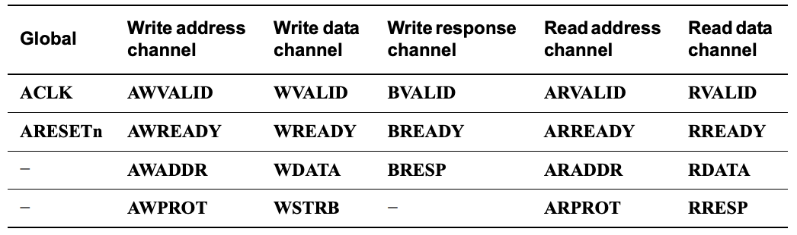

# AXI Protocol 

## Introduction

The Advanced eXtensible Interface (AXI for short) is a high-performance, high-bandwidth on-chip interconnect protocol developed by ARM as part of the AMBA (Advanced Microcontroller Bus Architecture) specification. AXI is the de facto standard for connecting processors, memory controllers, DMA engines, and peripherals in modern SoC (System-on-Chip) designs.

### Why AXI?

Modern SoCs need to handle massive data throughput between components - think high-resolution video streaming, AI inference, network packet processing. Traditional bus protocols like APB (Advanced Peripheral Bus) are simple but slow, handling one transaction at a time. AXI solves this by introducing several key features:

- **Separate Read/Write Channels**: Independent address, data, and response channels for reads and writes, allowing simultaneous transactions
- **Burst Transfers**: Send multiple data beats in a single transaction, dramatically reducing overhead
- **Out-of-Order Transaction Completion**: Multiple outstanding transactions can complete in any order using transaction IDs
- **Low Latency**: Pipelined architecture allows new transactions to start before previous ones complete

**Real-world example:** A video processing pipeline might have a camera sensor writing frames to memory (write channel) while a display controller simultaneously reads previous frames (read channel) and a neural network accelerator fetches weights (another read). AXI handles all three concurrently.

---

## Difference between AXI and AXI Stream

While both are part of the AMBA specification, they serve fundamentally different purposes:

### AXI (AXI4) - Memory-Mapped Protocol

**Purpose:** Random access to memory or registers

**Use case:** "Read from address 0x1000, write to address 0x2000"

**Key characteristics:**
- Has addresses (where to read/write)
- Supports burst transactions
- Bidirectional (can read and write)
- Handshaking on every channel (ready/valid)
- More complex (5 channels: read address, read data, write address, write data, write response)

**Example applications:**
- CPU accessing RAM
- DMA controller reading/writing buffers
- Register configuration of peripherals

### AXI Stream (AXI4-Stream) - Streaming Protocol

**Purpose:** Unidirectional data flow without addressing

**Use case:** "Here's a continuous stream of pixels/samples/packets"

**Key characteristics:**
- No addresses (data flows in order)
- Single channel (TDATA, TVALID, TREADY)
- Unidirectional (one-way flow)
- Lower latency and overhead
- Simpler interface (fewer signals)
- Optional signals: TLAST (packet boundaries), TID (stream identification), TKEEP/TSTRB (byte enables)

**Example applications:**
- Video pipelines (camera → image processor → display)
- DSP chains (ADC → filter → FFT → output)
- Network packet processing (MAC → packet parser → DMA)
- AI accelerator data flow (input buffer → neural network → output buffer)

For this specific GitHub repository, I will be implementing an AXI-lite interface, which should cover a lot of the basic fundamentals needed to build and design more complex AXI systems.

---

## Read Specifications

    

1. The master device starts the transaction by providing an explicit address to the slave device, saying: "I want the data at address `0x04F`."

2. The slave device provides the data that resides at address `0x04F` back to the master device through the data channel.

---

## Write Specifications

    

1. Unlike the read transaction, the master needs to provide both the address, and the data to write at that specific address in memory. 

2. The slave device replies with an acknowledgement signal to let the master know that the write was successful.

---

## Signal List (AXI-Lite)

Refer to the signal list specs below:

    

Since we're designing an AXI-Lite system, we will not be including the `BRESP` and the `RRESP` signals since they're not fully supported.

Global:
* ACLK: global clock
* ARESETn: active-low reset

Write address channel:
* AWVALID: write address valid
* AWREADY: write address ready
* AWADDR: write address
* AWPROT: protection type (optional)

Write data channel:
* WVALID: write data valid
* WREADY: write data ready
* WDATA: write data
* WSTRB: write strobe

Write response channel:
* BVALID: write response valid
* BREADY: write response ready
* BRESP: write response (optional)

Read address channel:
* ARVALID: read address valid
* ARREADY: read address ready
* ARADDR: read address
* ARPROT: protection type (optional)

Read data channel:
* RVALID: read response valid
* RREADY: read response ready
* RDATA: read data
* RRESP: read response (optional)

Just to clear up any confusion of what these terms mean originally, because it kinda confused me initially.

---

## AXI-Lite Master Design

Now with all of that out of the way, we can finally start deisgning the AXI-Lite Master.

---

## AXI-Lite Slave Design

---